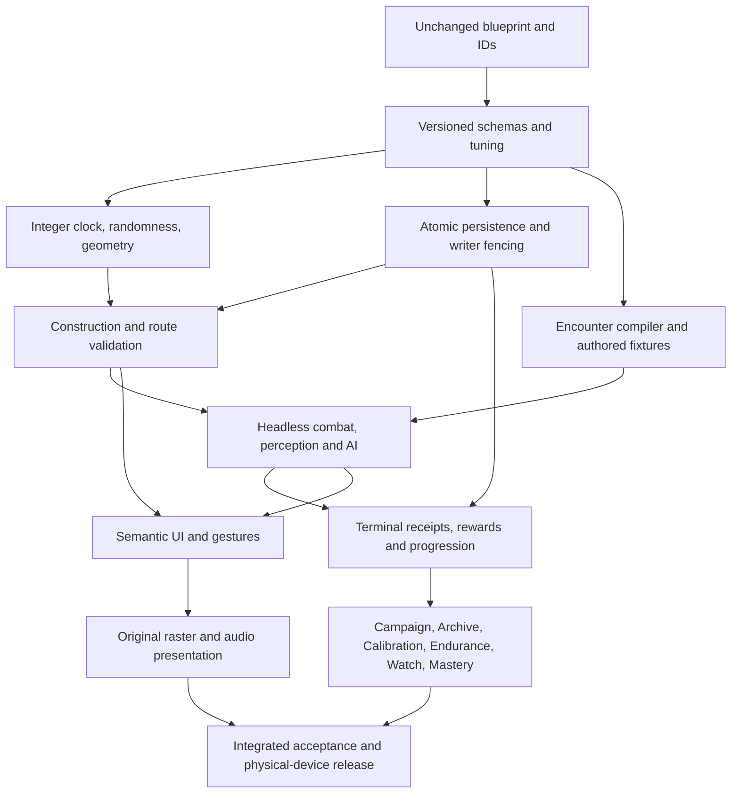

# Subsystem dependency graph

Per-requirement source lines, subsystem, dependency, gate, state, evidence and compatibility consequences are indexed in TRACEABILITY.csv. Registry-only content is Designed and must not be exposed as functional runtime content.
